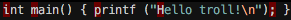

# vim-troll-stopper

Beware, there are (Unicode) trolls out there! Here, take this plugin for
protection.

#### Problem

There are many Unicode characters that are identical or look very
similar to one another. Best known example: semicolon (;) and a greek question
mark (;).

Trollers (e.g. your coworkers) can exploit this by replacing semicolons with
greek question marks in your code (original idea: Peter Ritchie, @peterritchie).
There are even [tools](https://github.com/reinderien/mimic) that help you with
this and take it to the next level.

Also, any random code snippet from the internet/stackoverlow can be corrupt.

Demo, a cannonical "hello troll" program:

    ⅰnt ⅿain() { рrintf ("Ηello troll!\n"); }

Copy-paste the above code to `hello.c` file and run `$ make hello`. Part of the
output:

    hello.c:1:1: error: unknown type name 'ⅰnt'
    ⅰnt ⅿain() { рrintf ("Ηello troll!\n"); }
    ^

Maybe you'd even start crying if you didn't know the above code is deceitful.

#### Solution

Vim users should know better than falling for these petty tricks.
This plugin highlights troll characters with a red background so you are alerted
something is not right.

After you install this plugin, things should just work for any and all
filetypes.

### Installation

Just use your favorite vim plugin manager.

### Features

- change highlight to custom color (in `.vimrc`)

        highlight TrollStopper ctermbg = red guibg = #FF0000

- use the `:TrollStop` command to convert invalid characters to regular ones

### License

[MIT](LICENSE.md)
